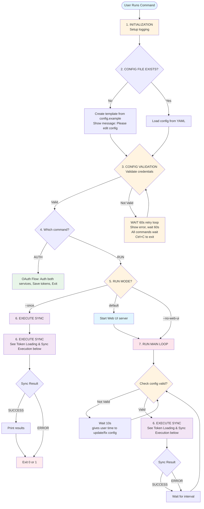
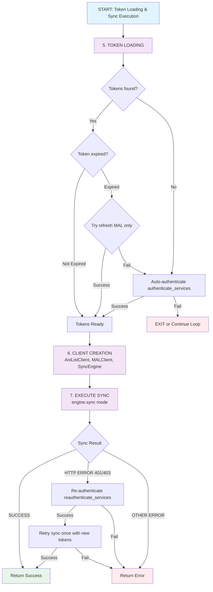
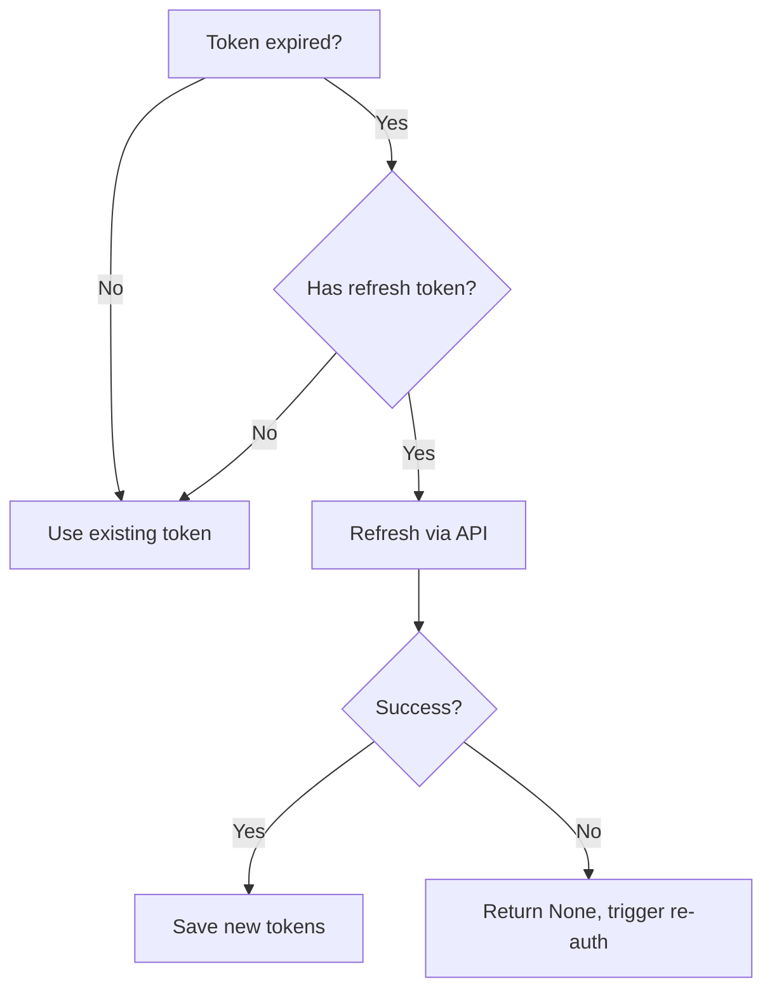
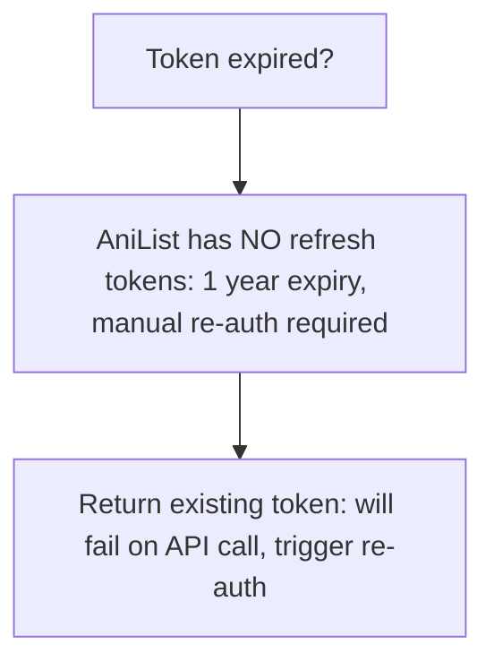

# AniList ⇄ MyAnimeList Sync

[](https://github.com/Tareku99/anilist-mal-sync/pkgs/container/anilist-mal-sync)

A service to synchronize anime lists between AniList and MyAnimeList with support for bidirectional sync.

## Credits

Inspired by the original idea from [bigspawn/anilist-mal-sync](https://github.com/bigspawn/anilist-mal-sync).<br>
This is a clean-room rewrite in Python with a fresh codebase and architecture.

## Features

- **Bidirectional sync** with conflict resolution (latest update wins)
- **One-way sync modes**: AniList → MAL or MAL → AniList
- **OAuth authentication** for both services
- **Docker deployment** with auto-configuration
- **YAML-based configuration** with validation
- **Rate limiting** and automatic retry logic
- **Web UI** for monitoring and configuration

### Planned Features

- Manga sync support
- Custom sync schedules per list type
- Webhooks for sync notifications
- Web UI for configuration and monitoring

## Quick Start (Deployment)

### 1. Get API Credentials

**AniList:**
1. Visit https://anilist.co/settings/developer
2. Click "Create Client"
3. Set **Redirect URL** to (comma-separated, **no spaces**):
   ```
   http://localhost:18080/callback,http://YOUR-SERVER-IP:18080/callback
   ```
4. Copy the **Client ID** and **Client Secret**

**MyAnimeList:**
1. Visit https://myanimelist.net/apiconfig
2. Click "Create ID"
3. Set **App Redirect URL** to (one per line):
   ```
   http://localhost:18080/callback
   http://YOUR-SERVER-IP:18080/callback
   ```
4. Copy the **Client ID** and **Client Secret**

### 2. Deploy

**Option A: Docker**

```bash
docker pull ghcr.io/tareku99/anilist-mal-sync:latest
docker-compose up -d
```

**Option B: Unraid**

- **Via Community Applications** (template not yet merged into CA Apps): Search for "AniList MAL Sync"
- **Manual Install**: Copy `anilist-mal-sync.xml` from this repo to `/boot/config/plugins/dockerMan/templates-user/` on your Unraid server

### 3. Configure

The container creates `data/config.yaml` on first run. Edit it with your credentials:

```bash
nano data/config.yaml  # Or your preferred editor
```

```yaml
oauth:
  port: 18080                                                # REQUIRED
  redirect_uri: "http://YOUR-SERVER-IP:18080/callback"       # REQUIRED - Use your server's IP

anilist:
  client_id: "your_anilist_client_id"                        # REQUIRED
  client_secret: "your_anilist_client_secret"                # REQUIRED
  username: "your_anilist_username"                          # REQUIRED
  # auth_url: "https://anilist.co/api/v2/oauth/authorize"    # OPTIONAL - has defaults
  # token_url: "https://anilist.co/api/v2/oauth/token"       # OPTIONAL - has defaults

myanimelist:
  client_id: "your_mal_client_id"                            # REQUIRED
  client_secret: "your_mal_client_secret"                    # REQUIRED
  username: "your_mal_username"                              # REQUIRED
  # auth_url: "https://myanimelist.net/v1/oauth2/authorize"  # OPTIONAL - has defaults
  # token_url: "https://myanimelist.net/v1/oauth2/token"     # OPTIONAL - has defaults

sync:
  mode: "bidirectional"                                      # OPTIONAL
  interval: 360                                              # OPTIONAL - Minutes between syncs
  log_level: "INFO"                                          # OPTIONAL
  dry_run: false                                             # OPTIONAL

# token_file_path: "/app/data/tokens.json"                   # OPTIONAL - has default
```

Restart: `docker-compose restart` (or wait 60s for auto-reload)

### 4. Authenticate

Check container logs for OAuth URLs, open them in your browser to authorize, and the service will start syncing automatically.

### 5. Access Web UI

Once running, access the web dashboard at:

```
http://YOUR-SERVER-IP:8080
```

The web UI provides:
- **Real-time status**: View current sync status, last sync time, next scheduled sync
- **Configuration editor**: Edit config.yaml directly from the browser with validation
- **Manual sync trigger**: Force an immediate sync without waiting for the schedule
- **Live monitoring**: See total sync count and last result

---

## Local Development

### Python (Direct)

```bash
git clone https://github.com/Tareku99/anilist-mal-sync
cd anilist-mal-sync
py install.py  # Creates venv and installs dependencies

# Activate virtual environment
.venv\Scripts\activate  # Windows
source .venv/bin/activate  # Linux/macOS

# Configure
cp config.example.yaml data/config.yaml
notepad data/config.yaml  # Edit with your credentials

# Authenticate
anilist-mal-sync auth

# Run
anilist-mal-sync run
```

> **Note**: Use `http://localhost:18080/callback` for `redirect_uri` when testing locally.

### Docker (Local Build)

```bash
# In docker-compose.yml, uncomment: build: .
docker-compose build
docker-compose up

# View logs for OAuth URLs, authorize in browser
```

Useful for testing Docker builds before deploying.

## Available Commands

### `auth` - Interactive authentication setup for AniList and MyAnimeList

**Options:**
- `--service` (default: both) Options: anilist, mal, both - Which service to authenticate with

```bash
# Authenticate both services
anilist-mal-sync auth

# Authenticate individual services
anilist-mal-sync auth --service anilist  # AniList only
anilist-mal-sync auth --service mal      # MyAnimeList only
```

Opens browser for OAuth authorization. Tokens are saved to `data/tokens.json`.

**Token Expiration:**
- **MyAnimeList**: Tokens expire after 31 days, auto-refresh using refresh token
- **AniList**: Tokens expire after 1 year, requires manual re-auth

### `run` - Run sync service (default: continuous sync with web UI)

Default: Runs continuous sync at specified interval with web UI.
Use --once for single sync, --no-web-ui for headless mode.

**Options:**
- `--mode` (default: bidirectional) Options: anilist-to-mal, mal-to-anilist, bidirectional - Sync mode: one-way or bidirectional
- `--dry-run` - Simulate sync without making changes
- `--interval` (default: 360) - Sync interval in minutes (default: 360 = 6 hours)
- `--log-level` (default: INFO) Options: DEBUG, INFO, WARNING, ERROR - Logging level
- `--once` - Run sync once and exit (no web UI, no continuous loop)
- `--no-web-ui` - Disable web UI (continuous sync only)
- `--port` (default: 8080) - Web UI port (default: 8080)
- `--host` (default: 0.0.0.0) - Web UI host

```bash
# Run with default settings (continuous sync with web UI)
anilist-mal-sync run

# Run sync once and exit
anilist-mal-sync run --once

# Run continuous sync without web UI
anilist-mal-sync run --no-web-ui

# Custom interval (in minutes)
anilist-mal-sync run --interval 60    # Every hour
anilist-mal-sync run --interval 1440  # Daily
```

Press `Ctrl+C` to stop.

**Sync configuration** is set in `config.yaml`:
```yaml
sync:
  mode: "bidirectional"  # Options: anilist-to-mal, mal-to-anilist, bidirectional
  dry_run: false         # Set to true to preview changes without applying
```

## How It Works

The service follows a unified flow for all commands, with automatic configuration validation, token management, and error handling.

### High-Level Execution Flow



### Token Loading & Sync Execution

All sync operations follow this internal flow:



**Key Behaviors:**
- **Config Validation**: All commands wait for valid configuration (60s retry loop)
- **Token Management**: Automatic token refresh for MAL, manual re-auth for AniList
- **Error Recovery**: Auto re-authentication on 401/403 errors with single retry
- **Continuous Operation**: `run` command continuously validates config and adapts to changes

### Error Scenarios

**Scenario 1: No Config File**
- Config file doesn't exist → Creates template from `config.example.yaml`
- Shows message: "Please edit the config file with your credentials"
- All commands continue after template creation

**Scenario 2: Invalid Config (Initial Validation)**
- Config has placeholder values → Shows detailed error message
- **All commands** wait in retry loop (60s intervals) until config is valid
- User can press Ctrl+C to exit

**Scenario 3: Invalid Config (During RUN Loop)**
- Config becomes invalid while `run` command is running
- Service pauses sync, waits 10s, then retries validation
- Service stays running, waiting for config to be fixed

**Scenario 4: No Tokens**
- Token file doesn't exist or tokens missing
- Auto-triggers OAuth authentication flow
- Continues with sync if auth succeeds

**Scenario 5: Expired Tokens**
- MAL: Auto-refreshes using refresh token
- AniList: Requires manual re-auth (no refresh token available)

**Scenario 6: Authentication Error During Sync**
- HTTP 401/403 during sync → Auto re-authenticates
- Retries sync once with new tokens
- Exits on failure (--once mode) or continues loop (continuous modes)

**Scenario 7: Config Changes During RUN**
- Config file modified while service running
- Reloads and revalidates config automatically
- Resumes sync if valid, pauses if invalid

### Token Refresh Logic

#### MAL Token Refresh



#### AniList Token Refresh



## Project Structure

```
src/anilist_mal_sync/
├── config.py          # Pydantic-based YAML configuration
├── cli.py             # Click CLI commands
├── anilist_client.py  # AniList API client
├── mal_client.py      # MyAnimeList API client
├── sync_engine.py     # Sync logic and conflict resolution
└── oauth.py           # OAuth flow and token management
```

## Contributing

Contributions are welcome! Please see [CONTRIBUTING.md](CONTRIBUTING.md) for guidelines.

## Additional Resources

- **[SUPPORT.md](SUPPORT.md)** - Get help and support
- **[SECURITY.md](SECURITY.md)** - Security policy and vulnerability reporting
- **[CODE_OF_CONDUCT.md](CODE_OF_CONDUCT.md)** - Community guidelines
- **[LICENSE](LICENSE)** - MIT License
